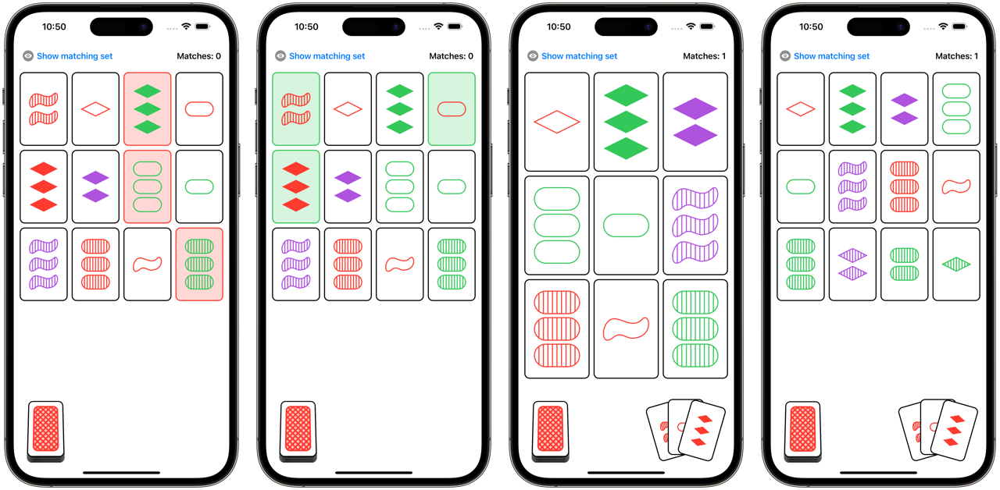

# SetGame
Assignments 3 & 4 for [Stanford University's course CS193p](https://cs193p.sites.stanford.edu) (Developing Applications for iOS) of Spring 2021.\
The goal of this assignment is to understand the animation mechanisms (Implicit, Explicit and Transition).

## Assignment Instructions
- [Assignment 3 (PDF)](https://cs193p.sites.stanford.edu/sites/g/files/sbiybj16636/files/media/file/assignment_3_0.pdf)
- [Assignment 4 (PDF)](https://cs193p.sites.stanford.edu/sites/g/files/sbiybj16636/files/media/file/assignment_4_0.pdf)

## Explanation of the Game
> The deck consists of 81 unique cards that vary in four features across three possibilities for each kind of feature: number of shapes (one, two, or three), shape (diamond, squiggle, oval), shading (solid, striped, or open), and color (red, green, or purple). Each possible combination of features (e.g. a card with three striped green diamonds) appears as a card precisely once in the deck.
> 
> In the game, certain combinations of three cards are said to make up a set. For each one of the four categories of features — color, number, shape, and shading — the three cards must display that feature as either a) all the same, or b) all different. Put another way: For each feature the three cards must avoid having two cards showing one version of the feature and the remaining card showing a different version.
> 
> For example, 3 solid red diamonds, 2 solid green squiggles, and 1 solid purple oval form a set, because the shadings of the three cards are all the same, while the numbers, the colors, and the shapes among the three cards are all different.
> 
> *[Source: Wikipedia](https://en.wikipedia.org/wiki/Set_(card_game))*

## Technologies
- SwiftUI
- MVVM Architecture

## Topics Covered
- Access Control
- Custom Shapes using Path (Diamond, Squiggle and StripedFill)
- GeometryReader
- Enums
- Closures
- Animation (Implicit, Explicit and Transition)

## Screenshots

## Preview
